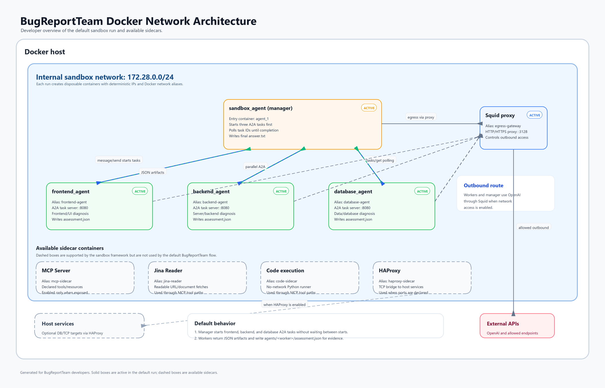

# BugReportTeam

BugReportTeam is a Python command-line project for running a small bug-report
assessment workflow inside hardened, disposable Docker containers on a shared
Docker network.

The default workload runs four agents:

- `frontend_agent`: a supporting A2A task agent. It assesses whether a bug
  report is likely related to web frontend or user-interface behavior.
- `backend_agent`: a supporting A2A task agent. It assesses whether a bug report
  is likely related to web server backend behavior.
- `database_agent`: a supporting A2A task agent. It assesses whether a bug
  report is likely related to database or data-layer behavior.
- `sandbox_agent`: the manager and entry agent. It broadcasts one bug report to
  all three specialists in parallel, collates their independent diagnoses, and
  writes the final classification to `answer.txt`.

Shared sidecars provide network and tool infrastructure:

- Squid proxy for controlled outbound network access.
- Optional MCP server sidecar for declared tools and resources.
- Optional HAProxy, code execution, Jina Reader, and Ollama sidecars for other
  sandbox capabilities.

> [!WARNING]
> This is an experimental sandboxing and sidecar orchestration project. It is a
> learning and hardening exercise, not a finished security model.

## Default Workload

On each default run:

1. `docker_sandbox` reads `src/sandbox_agent/sandbox_run.toml`.
2. It resolves all declared agents, sidecars, network settings, ACLs, and image
   requirements into `resolved-sandbox-plan.json`.
3. It builds or reuses one Docker image per unique functional agent image
   requirement.
4. It creates a per-run internal Docker network with deterministic IPs.
5. It starts required shared sidecars.
6. It starts `frontend_agent`, `backend_agent`, and `database_agent` as
   supporting A2A HTTP task services.
7. It runs `sandbox_agent` as the foreground entry agent.
8. `sandbox_agent` calls one local tool that starts all three worker A2A tasks
   before polling any of them.
9. Each worker asks GPT-4.1 mini for a likelihood percentage and short reasons,
   returns that assessment as an A2A task artifact, and writes a formatted
   `assessment.json` file in its mounted output directory.
10. `sandbox_agent` synthesizes the specialist assessments into a final category
    and priority, then writes `/sandbox-output/answer.txt`.
11. When the entry agent exits, the Docker network and containers are torn down.

## Run

From the repository root:

```powershell
.\.venv\Scripts\python.exe -m sandbox_agent
```

The host-side command delegates to `docker_sandbox`. Inside the container, the
same module runs the actual `sandbox_agent` workload.

Run artifacts are written under:

```text
.docker_sandbox/runs/run-YYYY-mm-dd-HH-MM-SS/
```

Expected worker evidence includes:

```text
.docker_sandbox/runs/run-YYYY-mm-dd-HH-MM-SS/agents/frontend_agent/assessment.json
.docker_sandbox/runs/run-YYYY-mm-dd-HH-MM-SS/agents/backend_agent/assessment.json
.docker_sandbox/runs/run-YYYY-mm-dd-HH-MM-SS/agents/database_agent/assessment.json
```

## Run-Level Spec

The run is declared by `src/sandbox_agent/sandbox_run.toml`:

```toml
schema_version = 1

agents = [
  "../frontend_agent/sandbox_spec.toml",
  "../backend_agent/sandbox_spec.toml",
  "../database_agent/sandbox_spec.toml",
  "sandbox_spec.toml",
]

[execution]
mode = "entry_agent"
entry_agent = "agent_1"
order = [
  "frontend_agent",
  "backend_agent",
  "database_agent",
  "agent_1",
]

[network]
enabled = true
internal = true
subnet = "172.28.0.0/24"

[squid_proxy]
default_allowed_domains = []
default_allowed_ip_addresses = []

[haproxy]
backend_host = "host.docker.internal"
default_ports = []

[mcp_sidecar]
default_tools = []
default_resources = []
container_capabilities = [
  "network",
]
application_capabilities = [
  "openai_agents",
]
```

## Agent Specs

Each worker declares `network`, `a2a`, and `openai_agents` capabilities. For
example, `src/frontend_agent/sandbox_spec.toml` declares:

```toml
schema_version = 1
agent_id = "frontend_agent"
module = "frontend_agent"

container_capabilities = [
  "network",
]

application_capabilities = [
  "a2a",
  "openai_agents",
]

[squid_proxy]
allowed_domains = []
allowed_ip_addresses = []

[mcp_sidecar]
tools = []
resources = []
```

The manager spec at `src/sandbox_agent/sandbox_spec.toml` declares `network`,
`a2a`, and `openai_agents`. It does not expose MCP tools in the default
BugReportTeam workflow.

Unknown keys, unknown capability values, duplicate IDs, invalid ports, and
invalid execution orders fail closed during parsing/planning.

## Architecture



The project has nine main packages:

- `a2a_support`: shared client and server helpers for the project's small A2A
  HTTP integrations, including Agent Card construction, JSON-RPC text messages,
  task polling, task artifacts, and parallel task collection.
- `sandbox_agent`: the entry manager workload. It owns the OpenAI Agents SDK
  prompt, parallel specialist A2A calls, final classification, and answer file.
- `frontend_agent`: supporting OpenAI Agents SDK task worker for frontend/UI
  likelihood assessment.
- `backend_agent`: supporting OpenAI Agents SDK task worker for web server
  backend likelihood assessment.
- `database_agent`: supporting OpenAI Agents SDK task worker for database and
  data-layer likelihood assessment.
- `mcp_sidecar`: optional MCP server container workload. It owns local MCP
  resources, local MCP tools, OpenAI image generation, MariaDB access, Microsoft
  Learn proxy tools, Jina Reader client logic, code-execution client logic, and
  audit logging.
- `code_sidecar`: optional no-network code-execution sidecar.
- `docker_sandbox`: the host/container harness. It owns TOML parsing, planning,
  per-agent image creation, Docker networking, sidecar startup, entry-agent
  execution, artifacts, and teardown.
- `sandbox_tester`: the copied probe suite used by `--test-sandbox`.

The default Docker topology is:

```text
Docker host
  docker_sandbox host runner
    |
    +-- Docker internal sandbox network
          |
          +-- sandbox-agent-*-frontend_agent container
          |     network alias: frontend-agent
          |     A2A task server on port 8080
          |
          +-- sandbox-agent-*-backend_agent container
          |     network alias: backend-agent
          |     A2A task server on port 8080
          |
          +-- sandbox-agent-*-database_agent container
          |     network alias: database-agent
          |     A2A task server on port 8080
          |
          +-- sandbox-agent-*-agent_1 container
          |     entry manager
          |     starts all three worker tasks and polls them together
          |
          +-- squid proxy container
                network alias: egress-gateway
```

## Runtime Environment

The default workload needs:

```text
OPENAI_API_KEY=<OpenAI API key>
```

Network access is needed during image builds to download Python packages and
Docker base images.

## Setup

Create the virtual environment and install development dependencies:

```powershell
.\scripts\setup-dev.ps1
```

## Development Checks

Run formatting, linting, type checking, and tests:

```powershell
.\scripts\check.ps1
```

This runs:

- `ruff format .`
- `ruff check .`
- `pyright`
- `pytest`

## Sandbox Probes

The copied SandboxTester probe suite can be run against the generated sandbox:

```powershell
.\.venv\Scripts\python.exe -m sandbox_agent --test-sandbox
```

To serialize probe evidence for troubleshooting:

```powershell
.\.venv\Scripts\python.exe -m sandbox_agent --test-sandbox --serialize-evidence
```

## Notes

BugReportTeam is a learning and hardening exercise, not a security proof. The
container policy reduces accidental host exposure and makes required capability
softening visible, but Docker, Landlock, seccomp, Squid, MCP tool boundaries,
sidecar behavior, and Python runtime guards should not be interpreted as a
complete isolation guarantee.

Generated assessments can vary between runs because they are model-generated.

Run artifacts under `.docker_sandbox/runs` are ignored by Git.

## Third-Party Notices

This project uses third-party packages including `a2a-sdk`, `mcp`, `openai`,
`openai-agents`, `pillow`, and `pymysql`. It also uses Docker images such as
`python:3.12-slim`, `ubuntu/squid:latest`, `haproxy:latest`,
`ollama/ollama:latest`, and `ghcr.io/jina-ai/reader:oss`. See each package and
image license metadata for details.

## License

GNU General Public License v3.0. See the `LICENSE` file for details.
